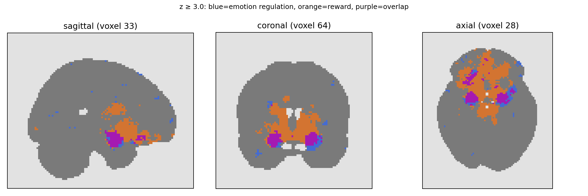

# Neurosynth Map Explorer

A reproducible **exploratory research prototype** for comparing Neurosynth term association maps. Start with [PROTOCOL.md](PROTOCOL.md) to see the research question, planned analyses, and interpretive limits.



The primary comparison is *emotion regulation* × *reward*, with *depression* as a secondary term. Positive z thresholds 2–5 are a sensitivity analysis; the overlap is descriptive and has no clinical interpretation. The [research note](results/RESEARCH_NOTE.pdf), [poster](results/RESEARCH_POSTER.pdf), and [results table](results/overlap.csv) show the completed analysis.

## Quick start

```bash
python -m venv .venv
# Windows PowerShell: .venv\Scripts\Activate.ps1
# macOS/Linux: source .venv/bin/activate
pip install -r requirements.txt
streamlit run app.py
```

On Windows PowerShell, open the folder containing `requirements.txt`. Use standard 64-bit Python 3.12 (or 3.13), rather than a free-threaded Python 3.15 interpreter. Check installed versions with `py -0p`. These commands work without activating the environment:

```powershell
dir requirements.txt
py -3.12 -m venv .venv312
.\.venv312\Scripts\python.exe -m pip install -r requirements.txt
.\.venv312\Scripts\python.exe -m streamlit run app.py
```

If Python 3.12 is unavailable, use standard Python 3.13 and replace `3.12`/`.venv312` with `3.13`/`.venv313`. A free-threaded Python 3.15 installation may try to compile PyArrow from source and fail without C++ Build Tools. A pip update notice is unrelated to this error.

To regenerate the two PDF reports, install `requirements-reporting.txt` and run `make_research_note.py` and `make_poster.py` with the environment's Python. The reports use Matplotlib's bundled fonts, so no system font path is required.

This package includes three retrieved **unthresholded association test** NIfTI z maps in `data/`, with exact source URLs and SHA-256 checksums in `results/provenance.json`. You can also download association maps from the [Neurosynth term pages](https://neurosynth.org/analyses/terms/) for [emotion regulation](https://neurosynth.org/analyses/terms/emotion%20regulation/), [reward](https://neurosynth.org/analyses/terms/reward/), and optionally [depression](https://neurosynth.org/analyses/terms/depression/). Use comparable map types from the same release. The ordinary website download may be FDR-corrected; do not mix that with the included unthresholded maps. Upload two or three `.nii` or `.nii.gz` files in the browser. Screenshots will not work.

To generate an auditable threshold table and file provenance from two downloaded maps:

```bash
python cli.py emotion_regulation.nii.gz reward.nii.gz --thresholds 2 3 4 5 --output results
python -m unittest tests.py
```

The output contains `overlap.csv` and `provenance.json` with source SHA-256 hashes and image geometry. Three source maps are bundled with attribution to Neurosynth and its Open Database License. To reproduce the complete comparison, run `python make_report.py`; outputs are in `results/`. The application rejects mismatched grids rather than silently comparing unrelated voxel locations.

## Interpretation

This project is descriptive. Jaccard and Dice measure overlap of positive z voxels at a user-chosen threshold. They are sensitive to threshold choice, grid, source studies, and keyword definitions. They are **not** effect sizes, p-values, diagnosis, proof of region specificity, or estimates of shared patients. See [Neurosynth FAQ](https://neurosynth.org/faq/) for the association versus uniformity distinction and [Neurosynth data](https://github.com/neurosynth/neurosynth-data) for provenance and licensing. Cite Neurosynth and comply with its data licence if distributing derivative datasets.

## Step 2: spatial follow-up

Run `python spatial.py` to regenerate `results/overlap_clusters_z3.csv` and `results/orthogonal_overlap_z3.png`. Components use six-neighbor connectivity and a 10-voxel reporting floor. Coordinates are in MNI space and are deliberately not assigned anatomical labels without atlas validation.

## Step 3: atlas annotation

Run `python atlas_labels.py` to regenerate `results/atlas_labels_z3.csv`. On first run it retrieves AAL SPM12 from the source archive linked by Nilearn. The script checks exact grid and affine alignment and reports both the peak's label and the distribution of AAL labels across each component. See the project report for interpretation.

## Step 4: robustness

Run `python robustness.py` to quantify how much of each of the two largest z ≥ 3 overlap components remains at z ≥ 4 and z ≥ 5. Results: `results/cluster_stability.csv`. The check describes threshold sensitivity, not statistical significance.

## Step 5: study-set audit

Run `python study_overlap.py` to retrieve term-associated study IDs and regenerate `results/study_overlap.csv` and `study_id_sets.json`. The latter stores the source endpoints and ID sets; it does not contain article full text. This quantifies shared studies but does not attribute voxels to individual studies.

## Step 6: interactive review

`streamlit run app.py` now opens with the included real maps selected. Choose two or three terms, change the positive z threshold and slice, and expand the audit panel for shared-study and atlas tables. You can still upload other compatible NIfTI maps; verify their provenance and map type first. The dashboard reports descriptive findings only.

## Step 7: cross-method analysis

The `neuroquery_maps/` folder contains three generated NeuroQuery maps and `results/neuroquery_provenance.json` records their source and hashes. `results/cross_method.csv` compares rank-based patterns after resampling Neurosynth maps to the 4 mm NeuroQuery grid. To regenerate the NeuroQuery images, install `requirements-replication.txt` and run `python generate_neuroquery.py`; the pretrained model download is about 56 MB. Then run `python cross_method.py`. This is a comparison of methods using related literature, not an independent replication.

## Step 8: cross-method sensitivity

Run `python cross_method_sensitivity.py` after installing `requirements-replication.txt`. It compares top 1%, 5%, and 10% spatial patterns; see `results/cross_method_sensitivity.csv`. The rank thresholds are descriptive.

## Step 9: research note

`results/RESEARCH_NOTE.pdf` is a two-page exploratory manuscript-style summary of the question, data, methods, principal findings, limitations, and a testable next question. Regenerate it with `python make_research_note.py` after installing ReportLab. It is not peer reviewed or suitable for clinical interpretation.

## Step 10: verify the research snapshot

Run `python verify_reproduction.py` after the base requirements are installed. It checks input hashes and image geometry, recomputes Neurosynth overlap tables, and confirms the saved study-set intersections. It writes `results/REPRODUCTION_AUDIT.json` and exits nonzero on mismatch. Regenerating the atlas labels or NeuroQuery maps from original external sources requires their respective downloaded resources.

## Step 11: clean-package verification and future changes

The project includes `.github/workflows/reproduce.yml`, which runs the unit checks and offline data audit on pushes and pull requests after you place the folder contents in a GitHub repository. `.gitignore` excludes downloaded model and atlas caches. Read `DATA_SOURCES.md` before republishing source maps or model outputs. The project is not automatically published.

## Step 12: guided notebook

Open `GUIDED_ANALYSIS.ipynb` from the project folder in JupyterLab or VS Code. If needed, install `requirements-notebook.txt`, then run `jupyter lab GUIDED_ANALYSIS.ipynb`. Work through the short code cells and interpretation prompts in order. All code cells were checked sequentially against the bundled data; an interactive Jupyter kernel was unavailable in the build environment, so saved cell outputs are intentionally empty.

## Step 13: research poster

`results/RESEARCH_POSTER.pdf` is a one-page A3 landscape summary for portfolio discussion. It includes the study question, principal maps and metrics, sources, limitations, and the next testable question. Regenerate it with `python make_poster.py` after installing ReportLab. Label it as exploratory and not peer reviewed when sharing it.

## Step 14: prospective independent validation

`INDEPENDENT_VALIDATION_PROTOCOL.md` is a draft plan for a future manually curated, post-2018 coordinate-based analysis. `validation_screening_template.csv` contains headers only; no new studies have been screened. Freeze the protocol before collecting data, record amendments, and verify that included studies are absent from the source corpora. The current automated-map findings generate the hypothesis and do not count as independent validation.

## Step 15: literature-search feasibility pilot

`pilot_pubmed.py` recorded exact PubMed search strings and counts on 28 September 2026. `validation_pilot/candidate_queue.csv` contains 50 unscreened, relevance-sorted candidate records, and `validation_pilot/PILOT_LOG.md` explains the workload implication. No new study has been deemed eligible and the prospective validation protocol is still a draft.

## Step 16: narrower search proposal

`narrow_pubmed.py` exports all 507 unique PMID from a narrower cognitive-reappraisal versus monetary-reward pilot into `validation_pilot/narrow_full_queue.csv`. Exact searches and counts are in `validation_pilot/narrow_search_log.json`. `validation_pilot/REVISION_PROPOSAL.md` records why this is a **proposed change to the research question**, not a silent amendment. All candidates remain unscreened; a second database and final protocol freeze are still required.

## Step 17: final synthesis

Read `FINAL_SYNTHESIS.md` for the concise result across all three term pairs, spatial and cross-method checks, boundaries of interpretation, and the proposed falsifiable independent-validation endpoint. It closes the exploratory phase; the literature pilots are not screened evidence.

## Next phase, step 1: operational validation draft

`validation_pilot/NARROW_PROTOCOL_DRAFT.md` turns the narrower task proposal into a decision sequence and lists the gates that must be resolved before screening. It is an unfrozen draft. The 507 PubMed records remain unscreened; no independent-validation result has been produced.

## Next phase, step 2: second-source feasibility

`validation_pilot/OPENALEX_PILOT.md` and `openalex_pilot_log.json` describe a bounded OpenAlex search. The script `pilot_openalex.py` exported at most the first 200 hits from each of four searches, with exact requests and deduplication against the PubMed pilot. The OpenAlex pages are incomplete and use broader search fields, so this is not the final second-database search or eligibility screening.

## Next phase, step 3: search-source quality audit

`validation_pilot/SEARCH_STRATEGY_DECISION.md` reports metadata coverage and literal title checks for the OpenAlex pages. Run `python audit_openalex_pilot.py` to regenerate `openalex_metadata_audit.json`. The current OpenAlex strategy is a pilot; a complete, field-defined second-source export remains a prerequisite for screening.

## Next phase, step 4: complete broad-source export

`validation_pilot/OPENALEX_FULL_EXPORT.md` documents a complete export of the four previously piloted OpenAlex queries: 8,354 unique OpenAlex IDs, all unscreened. `openalex_full_export.csv` and its hashed `openalex_full_log.json` are bundled. Run `python export_openalex_full.py` to regenerate with checkpointed pages; API counts may change over time. This broad full-text-inclusive search is supplementary and does not resolve the final field-defined search strategy.

## Next phase, step 5: cross-source linkage

Run `python audit_cross_source.py` to compare the complete OpenAlex export with the 507-record PubMed pilot by PMID and DOI. `cross_source_linkage.json` records 422 matched and 85 unmatched PubMed records; 424 OpenAlex IDs link to the matched group. `pubmed_unmatched_openalex.csv` is an audit queue, not a list of excluded articles. No screening decisions have been made.

## Next phase, step 6: field-defined second-source pilot

`validation_pilot/OPENALEX_TIAB_SEARCH.md` documents a complete, title/abstract-only OpenAlex export with 640 unique IDs. The exact OQO request bodies, page counts and file hash are in `openalex_tiab_log.json`; all records in `openalex_tiab_export.csv` are unscreened. Run `python export_openalex_tiab.py` to regenerate; indexing may change. Search-recall checks, final reruns, bibliographic deduplication and protocol freeze are still pending.

## Next phase, stages 1-5 readiness

`validation_pilot/PHASE2_READINESS_REPORT.md` gives the stage-by-stage status and remaining research tasks. `build_merged_queue.py` combines the two pilot exports into 731 unscreened identifier groups. `audit_source_corpora.py` compares the queue with bundled Neurosynth v0.7 and NeuroQuery model corpus metadata. `validation_gate.py` exits with status 2 and writes `VALIDATION_READINESS.json` until verified extracted experiments meet the prespecified feasibility conditions. No independent ALE result exists.
